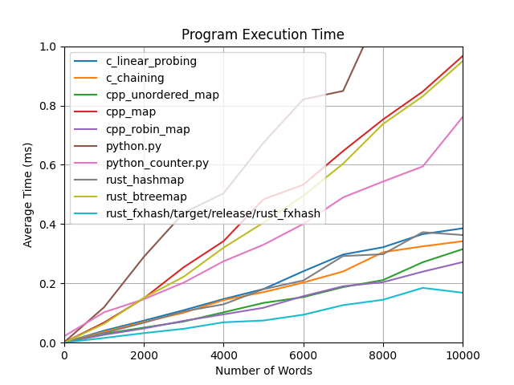

A simple comparison of different hash tables in computing the frequency (number of appearences) of words in a big list with duplicates.

Note - Using std::string_view to reduce copying in the C++ examples doesn't seem to have any effect on performance (even though we might expect this, given the performance boost of using &str in Rust). I believe this is because all of the words are small enough to fit inside the string without a heap allocation due to small string optimisation.